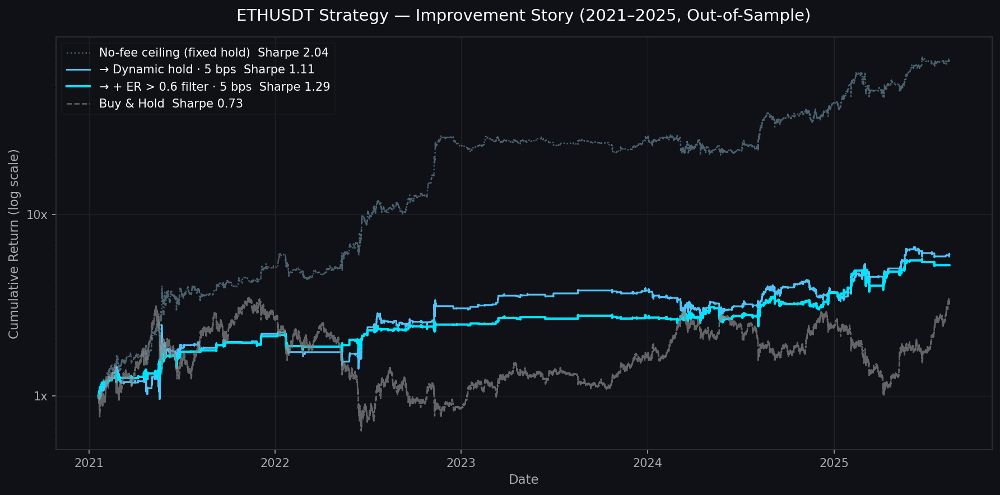

# ETHUSDT ML Trading Strategy

Machine learning strategy for ETHUSDT on 30-minute bars. Predicts 2-hour (4-bar) forward returns using walk-forward validation across 2019–2025 data.

---

## Results



Best strategy: **LightGBM + ElasticNet ensemble** with dynamic hold exit.

### With realistic transaction costs (fee-adjusted)

| Strategy | Fee | Sharpe | Annual Return | Max Drawdown | Trades/yr |
|----------|-----|--------|--------------|-------------|-----------|
| **Dynamic hold — 95th pctile** | **5 bps/side (taker)** | **1.11** | **48.2%** | **-43.2%** | **116** |
| **Dynamic hold — 75th pctile** | **2 bps/side (maker)** | **1.47** | **109.8%** | **-48.1%** | **593** |
| Buy & Hold | — | 0.73 | 29.9% | — | — |

### No-fee baseline (theoretical ceiling)

| Strategy | Sharpe | Annual Return | Max Drawdown |
|----------|--------|--------------|-------------|
| **Ensemble fixed hold — 80th pctile** | **2.07** | **158.6%** | **-30.2%** |
| ElasticNet (standalone) | 1.94 | 154.2% | -42.9% |
| Ridge (standalone) | 1.90 | 146.2% | -40.7% |
| LightGBM (standalone) | 1.86 | 141.5% | -46.4% |
| Buy & Hold | 0.73 | 29.9% | — |

> All metrics are out-of-sample across 8 walk-forward folds (2021–2025).
> Fee-adjusted results use the ensemble (LGB + ElasticNet). Threshold percentile tuned per cost level.

---

## Project Structure

```
qproj/
├── data/
│   └── ETHUSDT.csv                      # Raw 30-min OHLCV data (2019–2025, ~100k bars)
│
├── src/
│   ├── features.py                      # generate_features(), get_data()
│   ├── signals.py                       # threshold_signals(), build_position_holdN(), build_position_dynamic()
│   ├── backtest.py                      # evaluate_holdN(cost_bps=), decile_analysis()
│   ├── models.py                        # get_models() — all 6 model definitions
│   └── walk_forward.py                  # run_walk_forward(), eva_full_result()
│
├── configs/
│   ├── strategy_lgb.yaml                # LightGBM/XGBoost feature set (18 features)
│   └── strategy_linear.yaml             # Ridge/ElasticNet/Lasso feature set (19 features, +lags)
│
├── notebooks/
│   ├── 01_eda.ipynb                     # Raw data exploration
│   ├── 02_features.ipynb                # Feature distributions & correlations
│   ├── 03_research.ipynb                # Walk-forward training
│   └── 04_results.ipynb                 # Equity curves & evaluation
│
├── run_best.py                          # Best config per model family
├── run_ensemble_lgb_elastic.py          # Best no-fee ensemble: LightGBM + ElasticNet
├── run_stability.py                     # Per-fold Sharpe/return std analysis
├── run_signal_corr.py                   # Signal correlation between models
├── run_feature_importance.py            # LightGBM feature importance across folds
├── run_plot_equity.py                   # Generate equity curve chart
│
├── run_costs.py                         # Cost sweep (0/2/5/10/20 bps) across all models
├── run_threshold_sweep.py               # Threshold × cost sweep — fixed hold
├── run_horizon_sweep.py                 # Hold period (2h–24h) × cost sweep
├── run_dynamic_hold.py                  # Fixed vs dynamic hold comparison
├── run_dynamic_threshold_sweep.py       # Threshold × cost sweep — dynamic hold
└── run_pred_quality.py                  # Prediction quality: return_1 vs return_4
```

---

## Strategy Design

### Prediction target
4-bar forward return (2 hours ahead) on 30-min bars.

### Signal generation
1. Train model on a 20% rolling window
2. Compute `threshold = Nth percentile of |pred|` on training set (N tuned per cost level)
3. Go **long** if `pred > threshold`, **short** if `pred < -threshold + drift_bias`

### Position management — Dynamic Hold
Instead of a fixed 4-bar exit, the position stays open as long as the model remains convicted:

- **Enter** when prediction exceeds entry threshold
- **Hold** for at least 4 bars (minimum)
- **Exit** when the 4-bar prediction crosses zero (model conviction gone)
- Re-entry fires immediately on the same bar if the opposite signal triggers

This reduces round-trips from ~855/yr (fixed) to 116–593/yr (dynamic), which is critical for surviving transaction costs.

### Walk-forward validation
Sliding window: 20% train → 10% validate → step 10% forward, 8 folds total.

```
Fold 1:  |████████████████████|░░░░░░░░░░|
Fold 2:           |████████████████████|░░░░░░░░░░|
...
Fold 8:                                |████████████████████|░░░░░░░░░░|
         ▓ = Train (20%)   ░ = Validation (10%)
```

---

## Transaction Cost Analysis

The strategy is sensitive to fees because the fixed-hold variant trades ~2,000 times/year.

### Fixed hold — Sharpe degrades rapidly

| Cost (bps/side) | Sharpe | Annual Return |
|----------------|--------|--------------|
| 0 | 2.07 | 158.6% |
| 2 | 1.20 | 64.1% |
| 5 | -0.09 | -17.0% |

### Dynamic hold — survives taker fees

Dynamic hold reduces trades ~5–7x by staying in winning positions longer (avg hold: 17–22 bars vs fixed 4 bars).

| Fee scenario | Threshold | Sharpe | Annual | Trades/yr |
|---|---|---|---|---|
| 0 bps | 75th pctile | 1.87 | 171.5% | 593 |
| 2 bps (maker) | 75th pctile | **1.47** | **109.8%** | 593 |
| 5 bps (taker) | 95th pctile | **1.11** | **48.2%** | 116 |
| 10 bps | 99th pctile | 0.93 | 27.2% | 28 |

**Why dynamic hold works:** the 4-bar prediction is persistent — when the ensemble is bullish, it tends to stay bullish for many consecutive bars. Fixed hold throws away that continuation by force-exiting after 4 bars and immediately re-entering (paying the round-trip cost twice).

---

## Features

### Tree models (`strategy_lgb.yaml`) — 18 features
| Category | Features |
|----------|----------|
| Returns | `return_1`, `return_4`, `return_48`, `return_96` |
| Volatility | `volatility_48`, `max_volatility_480` |
| Momentum | `rsi`, `sma_cross`, `roc_20` |
| Price/SMA | `price_to_sma20`, `price_to_sma50`, `price_to_ema20` |
| Price-to-max | `close_to_max_240`, `close_to_max_2400` |
| Volume | `volume_ratio`, `volume_to_max_240`, `volume_to_max_480`, `force` |

### Linear models (`strategy_linear.yaml`) — 19 features
Same as above except `return_96` and `close_to_max_2400` replaced by:
| Feature | Description |
|---------|-------------|
| `return_4_lag48` | 2h return seen 24h ago |
| `return_4_lag96` | 2h return seen 48h ago |

> Lagged returns are computed on-demand only when listed in `feature_cols` to avoid polluting the tree model's dataset with NaN rows.

---

## Key Findings

**Feature importance (LightGBM, avg across 8 folds):**
```
volatility_48       16.6%  ████████
close_to_max_2400   11.4%  █████
close_to_max_240    10.3%  █████
sma_cross            9.8%  ████
return_96            9.4%  ████
max_volatility_480   8.7%  ████   ← top 6 = 66% of total gain
```

**Signal correlation between models:**
- Trees vs linear: ~0.15–0.19 (genuinely independent)
- Linear vs linear: 0.75–0.80 (nearly identical — pick one)
- LightGBM vs XGBoost: 0.48

**Why the ensemble works:**
LightGBM and ElasticNet have low signal correlation (0.19) but both have Sharpe > 1.86. Averaging their z-score-normalized predictions smooths out each model's bad folds. The ensemble MDD drops from -46% (LGB alone) to -30%.

**Stability (Sharpe std across 8 folds):**
| Model | Mean Sharpe | Std | Min (worst fold) |
|-------|------------|-----|-----------------|
| ElasticNet | 2.01 | 0.85 | 0.49 |
| Ridge | 1.70 | **0.78** | **0.64** — never lost money |
| LightGBM | 2.05 | 1.38 | 0.23 — high variance |

**Prediction quality (LightGBM directional accuracy):**
| Target | Dir Accuracy | Pearson r | Spearman IC |
|--------|-------------|-----------|-------------|
| return_4 (2h) | 50.1% | 0.026 | 0.008 |
| return_1 (30m) | 50.6% | 0.021 | 0.018 |

Both targets are weak predictors individually — alpha comes from consistent application across thousands of trades, not from individual prediction accuracy. The 4-bar model has 2.5× better signal/noise ratio than the 1-bar model, which is why using return_1 as an exit signal does not improve performance.

---

## Quick Start

```bash
# Install dependencies
pip install pandas numpy scikit-learn lightgbm xgboost pyyaml scipy matplotlib

# No-fee baseline: best standalone models
python run_best.py

# No-fee baseline: best ensemble
python run_ensemble_lgb_elastic.py

# Fee-adjusted: dynamic hold with threshold sweep
python run_dynamic_threshold_sweep.py

# Transaction cost sweep across all models
python run_costs.py

# Prediction quality diagnostic
python run_pred_quality.py

# Feature importance / stability / signal correlation
python run_feature_importance.py
python run_stability.py
python run_signal_corr.py
```

---

## Notes

- **No slippage modeled** — live performance will be lower, especially for large position sizes
- **No position sizing or stop-loss** — raw signal evaluation only
- Fee-adjusted results assume flat fee per side; rebate tiers on Binance Futures may improve maker-fee results further
- The 2019–2020 period (ETH bear/recovery) is training data only — all reported metrics are 2021–2025 OOS
